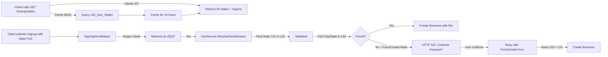

# US States Lookup System - Complete Implementation

## Overview
A complete US States reference system with 50 pre-seeded states, lookup endpoint, and validation integration for address profiles (Business & Customer).

---

## Database Schema (L52_Geo_States)

```sql
CREATE TABLE L52_Geo_States (
    ID              BIGINT PRIMARY KEY GENERATED BY DEFAULT AS IDENTITY,
    Code            VARCHAR(2) NOT NULL UNIQUE,          -- "CA", "TX", "NY"
    Name            TEXT NOT NULL,                       -- "California", "Texas", "New York"
    Region          TEXT,                                -- "West", "South", "Northeast"
    IsActive        BOOLEAN NOT NULL DEFAULT true,
    CreatedOn       TIMESTAMP WITH TIME ZONE NOT NULL,
    
    CONSTRAINT IX_L52_Code UNIQUE (Code),
    INDEX IX_L52_IsActive (IsActive)
);
```

---

## Entity Configuration Pattern

### StateConfiguration.cs (Infrastructure\Configurations)
```csharp
public class StateConfiguration : IEntityTypeConfiguration<State>
{
    public void Configure(EntityTypeBuilder<State> builder)
    {
        // Column definitions
        // Indexes: unique on Code, standard on IsActive
        // Table name: L52_Geo_States
        
        builder.HasData(
            new State { Id = 1, Code = "AL", Name = "Alabama", Region = "South", ... },
            new State { Id = 2, Code = "AK", Name = "Alaska", Region = "West", ... },
            // ... 48 more states
        );
    }
}
```

**Key Pattern:** Seed data is defined in the **configuration file** using `builder.HasData()`, NOT in the migration. This centralizes all entity definitions in one place.

---

## Service Layer

### IStateService.cs
```csharp
public interface IStateService
{
    /// Returns all active states as { "CA" => "California (CA)", ... }
    Task<Dictionary<string, string>> GetStatesLookupAsync();

    /// Validates a 2-character state code exists in the database
    Task<Domain.State?> ValidateStateCodeAsync(string code);
}
```

### StateService.cs (Application\Services)
- **GetStatesLookupAsync()**: Returns keyed lookup with 24-hour cache TTL for dropdown population
- **ValidateStateCodeAsync()**: O(1) lookup via unique index on `Code` column for signup validation

---

## API Endpoint

### GET /lookup/states
**Response (200 OK):**
```json
{
  "data": {
    "AL": "Alabama (AL)",
    "AK": "Alaska (AK)",
    ...
    "WY": "Wyoming (WY)"
  },
  "message": "US states lookup retrieved successfully.",
  "success": true
}
```

**Use Case:** Client populates a state dropdown on signup forms.

---

## Validator Integration

### SignUpDtoValidator.cs (Business User)
```csharp
RuleFor(s => s.State)
    .NotEmpty().WithMessage("State is required.")
    .Length(2).WithMessage("State must be a valid 2-character US state code (e.g., CA, TX, NY).")
    .Matches(@"^[A-Z]{2}$").WithMessage("State must be exactly 2 uppercase letters (e.g., CA, TX, NY).");
```

**Validation Flow:**
1. FluentValidation enforces 2-char uppercase format
2. GeoService::ResolveGeoIdsAsync validates City/State exists in L50_Geo_Cities
3. If not found and ForceCreate = false ? HTTP 422 (GeoLocationNotFoundException)
4. User confirms ? retry with ForceCreate = true ? inserts new record with UserInput = true

---

## Seed Data - All 50 US States

| ID  | Code | Name                | Region        |
|-----|------|---------------------|---------------|
| 1   | AL   | Alabama             | South         |
| 2   | AK   | Alaska              | West          |
| 3   | AZ   | Arizona             | West          |
| 4   | AR   | Arkansas            | South         |
| 5   | CA   | California          | West          |
| ...  | ...  | ...                 | ...           |
| 50  | WY   | Wyoming             | West          |

**Regions:** West, South, Northeast, Midwest

---

## Registration in Program.cs

```csharp
builder.Services.AddScoped<IStateService, StateService>();

// ... in endpoint mapping section:
app.MapLookupStates();
```

---

## Migration

**File:** `20260310181904_AddStateTable_L52_Geo_States.cs`

**What it does:**
- Creates `L52_Geo_States` table with columns and indexes
- **Does NOT include seed data** (handled by StateConfiguration)

**Why separation?**
- Keeps migrations minimal (schema only)
- Seed data managed in configuration files (DRY principle)
- Same pattern as CouponTypeConfiguration for consistency

---

## Complete Signup Flow with States



---

## Files Created / Modified

| File | Action | Purpose |
|------|--------|---------|
| `Domain\State.cs` | Create | Entity: Id, Code, Name, Region, IsActive, CreatedOn |
| `Infrastructure\Configurations\StateConfiguration.cs` | Create | Config + HasData with 50 states |
| `Infrastructure\BizyPopDbContext.cs` | Modify | Add `DbSet<State> States` |
| `Common\Features\State\DTOs\StateDto.cs` | Create | DTO for responses |
| `Application\Services\IStateService.cs` | Create | Service interface |
| `Application\Services\StateService.cs` | Create | Service implementation with caching |
| `BizyPopAPIs\Features\State\LookupStatesEndpoint.cs` | Create | GET /lookup/states endpoint |
| `Common\Features\Auth\SignUp\Validators\SignUpDtoValidator.cs` | Modify | Add 2-char state validation |
| `Infrastructure\Migrations\20260310181904_AddStateTable_L52_Geo_States.cs` | Create | Schema only; seed via config |
| `BizyPopAPIs\Program.cs` | Modify | Register service + endpoint |

---

## Performance Notes

- **State Code Lookup:** O(1) via unique index on `Code` column
- **Caching:** 24-hour TTL on dropdown data (highly cacheable)
- **Validation:** Pre-validated client input before GeoService calls (reduces DB queries)
- **Storage:** 50 static records (negligible space)

---

## Next Steps (Future Enhancements)

- [ ] Add state flag emoji or abbreviation UI icons
- [ ] Extend StateService to filter by region (for grouped dropdowns)
- [ ] Add state population/area metadata for analytics
- [ ] Create admin endpoint to manage/deactivate states

